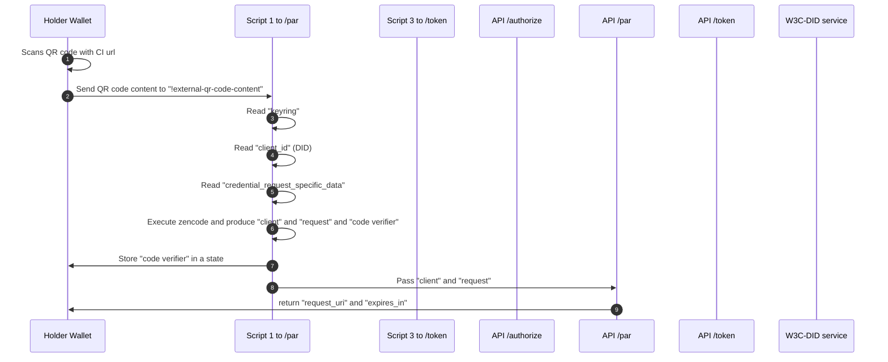

### OpenID4VC flow

```mermaid 
sequenceDiagram 
autonumber
  participant H as Holder Wallet
  participant S1 as Script 1 to /par
  participant S3 as Script 3 to /token
  participant A as API /authorize
  participant P as API /par
  participant T as API /token
  participant DID as W3C-DID service
  
  H->>H: Scans QR code with CI url  
  H->>S1: Send QR code content to "!external-qr-code-content"
  S1->>S1: Read "keyring"
  S1->>S1: Read "client_id" (DID)
  S1->>S1: Read "credential_request_specific_data" 

  S1->>S1: Execute zencode and produce "client" and "request" and "code verifier"
  S1->>H: Store "code verifier" in a state
  S1->>P: Pass "client" and "request"
  P->>H: return "request_uri" and "expires_in" 


```
Glossary: 

Script 1: [Script 1](https://github.com/ForkbombEu/mobile_zencode/blob/main/wallet/1_holder_to_authorize_on_authz_server.zen)
