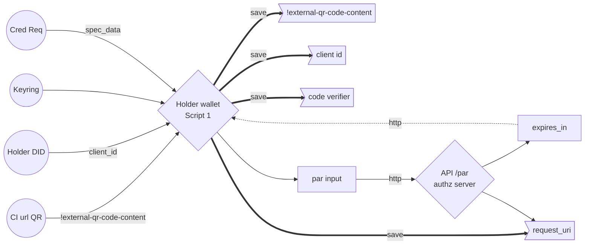
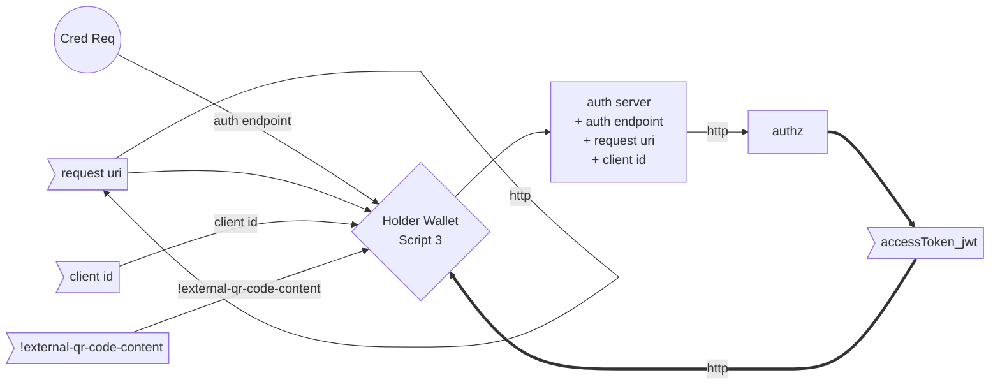

### OpenID4VC flow

Glossary: 

Script 1: [Script 1](https://github.com/ForkbombEu/mobile_zencode/blob/main/wallet/1_holder_to_par_on_authz_server.zen)

# Auth Flow Chart

## Script 1

## Script 3

## Script 5

